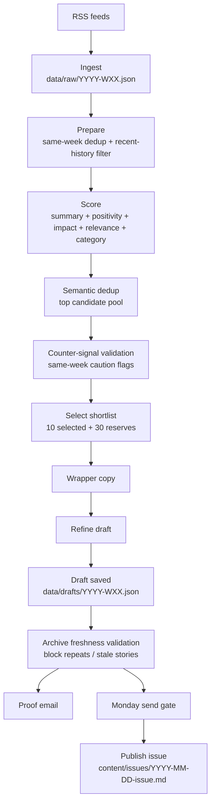

# Good Brief Architecture

## Overview

Good Brief is a static Astro site plus a scheduled newsletter pipeline.

- `data/raw/<week>.json` stores the weekly RSS buffer
- `data/pipeline/<week>/` stores phase artifacts
- `data/drafts/<week>.json` stores the draft used for proofing and send gating
- `content/issues/<date>-issue.md` stores published archive issues

## Runtime Diagram

## Pipeline Stages

1. `prepare`
Removes obvious same-week duplicates and filters stories already covered in recent issues or drafts.

2. `score`
Generates Romanian summaries and assigns `positivity`, `impact`, `romaniaRelevant`, and `category`.

3. `semantic-dedup`
Uses AI to collapse different phrasings of the same underlying story inside the top candidate pool.

4. `counter-signal-validate`
Looks for same-week related coverage that weakens a story. This adds flags and ranking penalties; it does not approve or reject the draft by itself.

5. `select`
Ranks by weighted score adjusted by counter-signal penalties, then keeps `10` selected stories and `30` reserves.

6. `wrapper-copy`
Generates greeting, intro, sign-off, and short summary for the selected stories.

7. `refine`
Performs an editorial pass over the selected stories plus reserves and can swap items before saving the draft.

8. `validate-draft-freshness`
Final approval gate. It checks selected and reserve stories against published issues and recent drafts, blocks stale or repeated items, auto-promotes reserves when possible, and marks the draft as `passed` or `failed`.

## Validation Model

There are two validation layers:

- Same-week validation
  Implemented by `counter-signal-validate`. Writes `validation.flagged`.

- Archive freshness validation
  Implemented by `validate-draft-freshness`. Writes `validation.status`, `approvalSource`, `blockedArticles`, `replacements`, and `agentReviewed`.

Monday delivery only proceeds when archive freshness validation passes with `approvalSource: "validation-pipeline"` for post-legacy drafts.

## Scheduled Workflows

- `ingest-news.yml`
  Runs every 6 hours and updates the weekly raw buffer.

- `generate-newsletter.yml`
  Runs on Saturday, executes the staged pipeline, validates draft freshness, commits artifacts, and sends the proof email.

- `send-newsletter.yml`
  Runs on Monday, checks send preflight and draft validation, sends the broadcast, then publishes the issue markdown.
